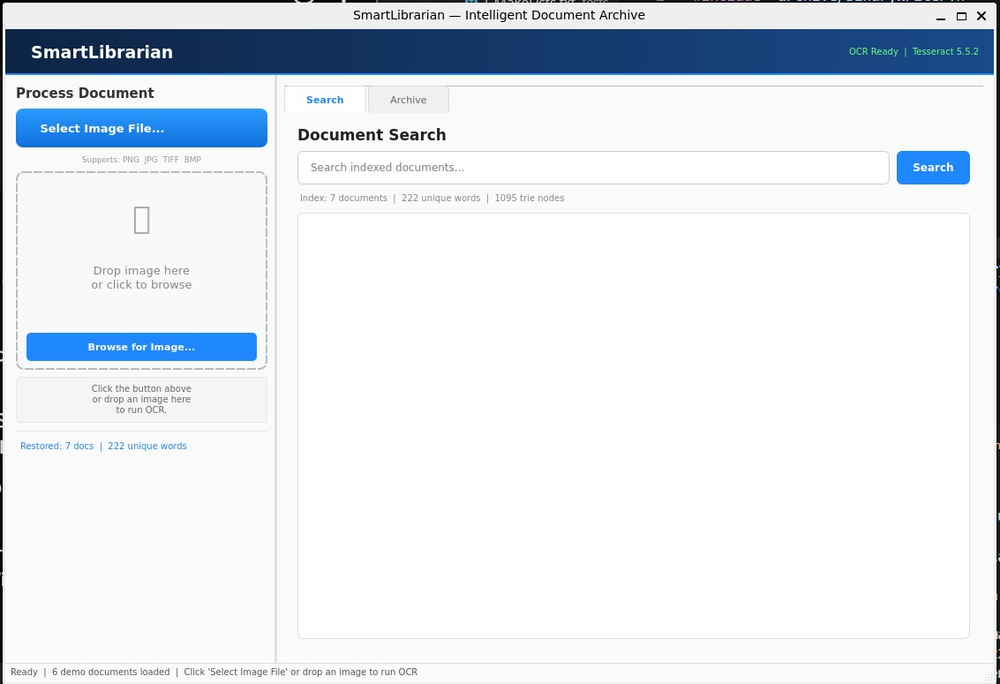
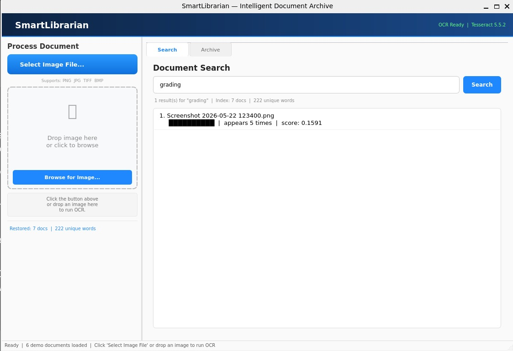
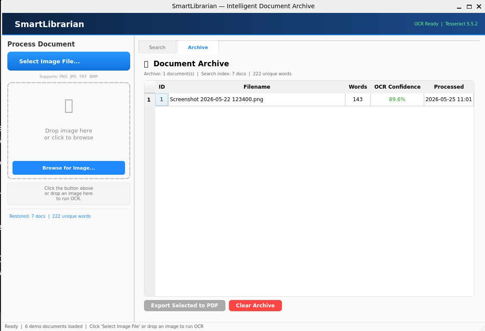
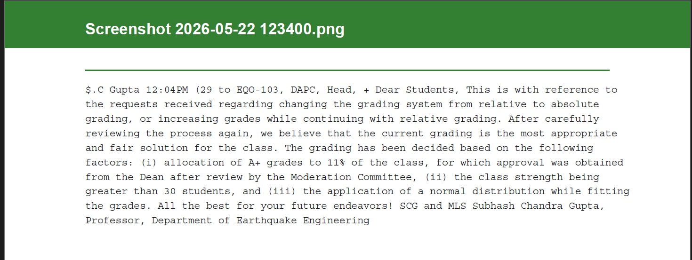

<div align="center">



# SmartLibrarian

**An intelligent document archival system built from scratch in C++17**

[](https://github.com/YOUR_USERNAME/smart-librarian/actions)
[](https://en.cppreference.com/w/cpp/17)
[](LICENSE)
[](#testing)
[](#building-from-source)

*Built as a portfolio project to go deep on systems programming concepts —
not just "it works" but understanding every byte, every allocation, and every design decision.*

</div>

---

## What Is This?

SmartLibrarian lets you drop a scanned document image into a desktop app, extract all the text using OCR, and then search across everything you've ever processed — instantly.

The interesting part isn't the feature. It's how it's built:

- The **PDF writer** constructs binary PDF files byte-by-byte, manually tracking object offsets to build a valid cross-reference table — no PDF library involved
- The **search engine** uses a hand-written Trie for prefix autocomplete and an inverted index with TF-IDF scoring for ranked results
- The **OCR pipeline** preprocesses images through grayscale conversion, Otsu's adaptive thresholding, and median noise filtering before passing them to Tesseract
- The **persistence layer** serializes the entire search index to a custom binary format with magic-number validation and version fields
- The **GUI** uses Qt6 with a proper worker-thread architecture so OCR never blocks the UI

Every one of these was written from scratch to understand the internals, not to ship fast.

---

## Screenshots

<div align="center">

| Search Tab | Archive Tab |
|:---:|:---:|
|  |  |

| PDF Output | OCR Processing |
|:---:|:---:|
|  |  |

</div>

---

## Technical Deep Dives

### Custom PDF Engine

Most people reach for a library. I wanted to understand what a PDF actually is at the byte level.

A PDF is a structured binary file where every object (pages, fonts, content streams) has an entry in a cross-reference table recording its exact byte offset from the start of the file. This is what lets PDF readers jump directly to any object in O(1) instead of scanning from the beginning.

The challenge: you can't write the cross-reference table until you know the byte offset of every object, but you need to reference objects before you've written them. Solution: pre-allocate all object numbers first, then record each object's byte offset as it's written, and serialize the xref table at the end using those recorded offsets.

```text
%PDF-1.7
<binary marker bytes>

1 0 obj << /Type /Catalog /Pages 2 0 R >> endobj
2 0 obj << /Type /Pages /Kids [3 0 R] /Count 1 >> endobj
...

xref
0 6
0000000000 65535 f  ← free list head (always)
0000000009 00000 n  ← object 1 starts at byte 9
0000000058 00000 n  ← object 2 starts at byte 58
...

trailer << /Size 6 /Root 1 0 R >>
startxref
[byte offset of xref]
%%EOF
```

The xref entries are exactly 20 bytes wide — fixed width so readers can binary search them.

**Key files:** `src/pdf/PdfWriter.cpp`, `src/pdf/PdfStream.cpp`

---

### Search Engine

The search engine has two separate data structures for two separate problems.

**Trie** (prefix tree) — for autocomplete. Each node is a character, each path from root to a marked node is a complete word. Finding all words starting with "neur" is O(m + k) where m is the prefix length and k is the number of matches — completely independent of vocabulary size. An `unordered_map<char, unique_ptr<TrieNode>>` per node keeps memory proportional to actual children rather than always allocating 26 slots.

**Inverted Index** — for ranked search. Maps every word to its posting list: the documents containing it, how many times it appears in each, and its first position. TF-IDF scoring ranks results:

```text
TF = (occurrences in this doc) / (total words in this doc)
IDF = log( (1 + total docs) / (1 + docs containing word) ) + 1
score = TF × IDF
```

Common words that appear everywhere get low IDF scores. Rare, specific words that appear frequently in one document get high scores. That's relevance ranking.

**Key files:** `src/search/Trie.cpp`, `src/search/InvertedIndex.cpp`, `src/search/SearchEngine.cpp`

---

### OCR Preprocessing Pipeline

Raw scans are noisy. Running Tesseract directly on an unprocessed image gives poor results. The preprocessing pipeline runs five stages:

```text
RGB image
|
▼ toGrayscale()    ITU-R BT.601: Y = 0.299R + 0.587G + 0.114B
|                  (weighted because eyes are more sensitive to green)
▼ normalizeContrast() Stretch histogram so min→0, max→255
|                  (fixes faded photocopies)
▼ scale(2x)        Nearest-neighbor upscale
|                  (nearest-neighbor keeps text edges sharp —
|                   bilinear would create gray anti-aliased pixels
|                   that confuse the classifier)
▼ binarize()       Otsu's adaptive thresholding
|                  (finds the optimal black/white split point
|                   from the actual image histogram — no hardcoded value)
▼ removeNoise()    3×3 median filter
                   (replaces each pixel with the median of its
                    9-pixel neighborhood — removes speckles
                    without blurring text edges)
```

**Key files:** `src/ocr/ImagePreprocessor.cpp`, `src/ocr/OcrEngine.cpp`

---

### Binary Persistence Format

The search index and document archive survive between sessions using a custom binary format — three files in `~/.smartlibrarian/`.

Every file starts with an 8-byte magic number (`SLIDX001`, `SLARC001`, `SLCFG001`) and a 4-byte version field. On load, the magic is verified before reading anything else — corrupt files or files from other programs get rejected cleanly rather than causing undefined behavior trying to parse garbage.

Multi-byte integers are stored in explicit little-endian byte order. Strings use length-prefix encoding `[uint32 length][N bytes]` rather than null-termination, so the reader can allocate exactly the right buffer size upfront.

The float serialization uses `memcpy` to reinterpret the bit pattern as `uint32_t` before writing — the standards-compliant way to do type-punning in C++ (as opposed to `reinterpret_cast` which violates strict aliasing rules).

**Key files:** `src/archive/BinaryWriter.cpp`, `src/archive/BinaryReader.cpp`, `src/archive/PersistenceManager.cpp`

---

### Qt6 Threading Architecture

OCR takes 1-3 seconds per image. Running it on the main thread would freeze the window — the event loop can't process repaints or input while your code is blocking.

The solution is Qt's worker-object pattern:

```text
Main Thread                     OCR Thread
|                               |
| user drops image              |
| ──emit startOcrProcessing────▶|
|                               OcrWorker::process()
|                               [loads image]
|                               [preprocesses]
| ◀──emit progressUpdated(30%)──|
| progress bar updates          |
|                               [runs Tesseract]
| ◀──emit ocrCompleted(text)────|
| index document                |
| update archive                |
```

Cross-thread signals are automatically queued by Qt — the receiving slot always runs on its own thread's event loop. No mutexes needed for the signal/slot communication itself.

**Key files:** `src/gui/MainWindow.cpp`, `src/gui/OcrWorker.cpp`

---

## Project Structure

```text
smart-librarian/
├── src/
│   ├── core/        Application lifecycle
│   ├── gui/         Qt6 desktop interface (5 classes)
│   ├── ocr/         Tesseract pipeline + image preprocessing
│   ├── pdf/         Custom binary PDF writer
│   ├── search/      Trie + Inverted Index + TF-IDF
│   ├── archive/     Binary persistence layer
│   └── utils/       Logger
├── include/         Public headers mirroring src/ structure
├── tests/
│   └── unit/        GoogleTest suites (47 tests)
│       ├── search/  15 search engine tests
│       ├── pdf/     17 PDF engine tests
│       ├── archive/ 14 persistence tests
│       └── ocr/     16 preprocessing tests
├── assets/
│   ├── screenshots/ README images
│   └── test_images/ Sample images for manual testing
└── docs/            Architecture notes
```

---

## Building from Source

### Prerequisites

```bash
# Ubuntu / WSL2
sudo apt update
sudo apt install -y \
    build-essential cmake ninja-build git \
    tesseract-ocr tesseract-ocr-eng \
    qt6-base-dev libqt6widgets6 qt6-tools-dev \
    libgl1-mesa-dev libxcb-xinerama0-dev

# vcpkg (for GoogleTest and stb_image)
git clone https://github.com/microsoft/vcpkg.git ~/vcpkg
~/vcpkg/bootstrap-vcpkg.sh
~/vcpkg/vcpkg install gtest:x64-linux stb:x64-linux
```

### Build

```bash
git clone https://github.com/YOUR_USERNAME/smart-librarian.git
cd smart-librarian

cmake -S . -B build -G Ninja \
    -DCMAKE_BUILD_TYPE=Release \
    -DCMAKE_TOOLCHAIN_FILE="$HOME/vcpkg/scripts/buildsystems/vcpkg.cmake"

cmake --build build -- -j$(nproc)
```

### Run

```bash
export DISPLAY=:0          # WSL2 only
./build/bin/SmartLibrarian
```

### Testing

```bash
cd build
ctest --output-on-failure --parallel $(nproc)

# Or run individual suites
./bin/test_search --gtest_color=yes
./bin/test_pdf    --gtest_color=yes
./bin/test_archive --gtest_color=yes
```

---

## Tech Stack

| Layer | Technology | Why |
|---|---|---|
| Language | C++17 | `std::filesystem`, structured bindings, `if constexpr` |
| Build | CMake 3.20 + Ninja | Out-of-source builds, proper target-based dependency graph |
| GUI | Qt6 Widgets | Signal/slot threading, cross-platform, native look |
| OCR | Tesseract 5.x | Best open-source OCR, C++ API, LSTM neural network |
| Package manager | vcpkg | CMake-integrated, per-project library management |
| Testing | GoogleTest | Industry standard, `gtest_discover_tests` CTest integration |
| Persistence | Custom binary | No dependencies, demonstrates format design knowledge |
| PDF | Custom writer | Same reason — understanding the format > using a library |

---

## C++ Concepts Demonstrated

This project was built specifically to practice and demonstrate:

- **RAII** throughout — every resource (file handles, Tesseract API, Qt threads) is managed by a destructor
- **Move semantics** — `ImageBuffer` moves pixel data without copying megabytes
- **Smart pointers** — `unique_ptr` for exclusive ownership, raw pointers for borrowed references
- **Rule of five** — explicitly deleted copy operations where ownership is non-trivial
- **const correctness** — const/non-const overloads for `findNode()` using the const_cast pattern
- **Template basics** — `std::unordered_map`, `std::vector` with reserve() for allocation control
- **Binary I/O** — `ios::binary`, explicit little-endian encoding, `memcpy` for type punning
- **Threading** — Qt worker-object pattern, `moveToThread()`, queued signal/slot connections
- **C++17 filesystem** — `std::filesystem::path`, `create_directories`, `std::error_code`
- **Pimpl idiom** — `OcrEngine` hides Tesseract headers from its public interface

---

## What I Learned Building This

The most surprising thing was how much simpler some "hard" things turned out to be once I looked at them directly. A PDF is just text and bytes following a spec — not magic. A search engine is just a hash map of word → document list — the sophistication is in the ranking math. A Trie is just a tree where the edges are characters.

The hard parts were the engineering decisions: when to copy vs move, how to structure ownership across module boundaries, how to keep the GUI responsive while doing expensive work on another thread. Those decisions don't show up in algorithm textbooks.

If I were to extend this further I'd add: phrase search (positional posting lists), Unicode-aware tokenization, image deskewing before OCR, and a proper query language parser.

---

## License

MIT — see [LICENSE](LICENSE)

---

<div align="center">
<sub>Built with way too much time spent reading PDF spec documents and Tesseract source code</sub>
</div>
README_EOF


